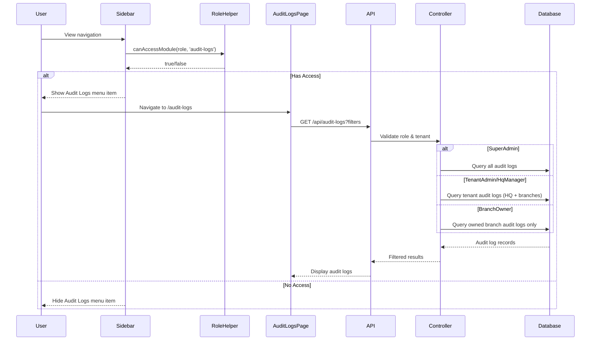
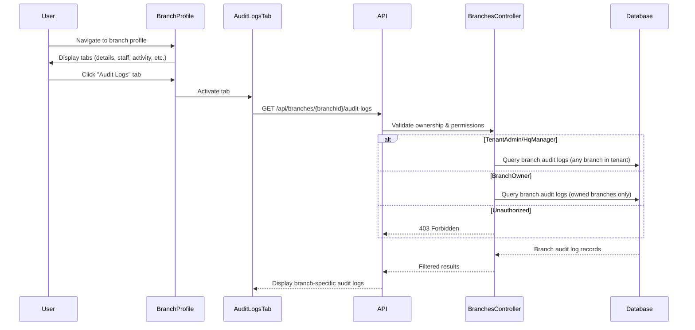
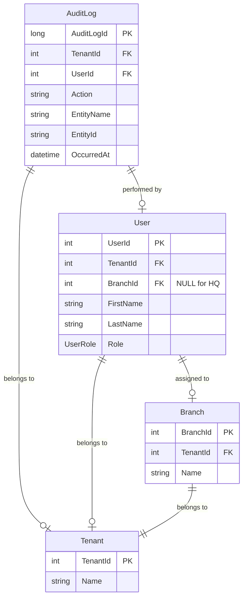

# Design Document: Audit Logs Access Expansion

## Overview

This feature expands audit log access from SuperAdmin-only to include management-level roles (TenantAdmin, HqManager, BranchOwner) while maintaining strict data isolation and role-based filtering. The design builds upon the existing audit logging infrastructure by adding:

1. **Role-based access control** - Extending permissions to management roles
2. **Multi-tenant data isolation** - Ensuring tenants only see their own audit logs
3. **Branch-level scoping** - Distinguishing HQ vs branch activities
4. **Branch-specific audit log viewing** - New UI component for branch profile pages
5. **Enhanced filtering** - Branch filter dropdown on main audit logs page

### Design Goals

- **Security First**: Enforce authorization at both frontend and backend layers
- **Data Isolation**: Guarantee complete tenant separation in audit log access
- **Role-Appropriate Access**: Provide each role with exactly the audit log scope they need
- **Minimal Changes**: Leverage existing infrastructure and patterns
- **Consistent UX**: Match existing audit log page design and behavior

## Architecture

### High-Level Architecture

```mermaid
graph TB
    subgraph "Frontend Layer"
        A[Sidebar Navigation] -->|canAccessModule| B[Role Helper]
        C[Main Audit Logs Page] -->|API Call| D[/api/audit-logs]
        E[Branch Profile Page] -->|API Call| F[/api/branches/:id/audit-logs]
        G[Branch Audit Logs Tab] -->|Renders in| E
    end
    
    subgraph "Backend Layer"
        D -->|Authorization| H[AuditLogsController]
        F -->|Authorization| I[BranchesController]
        H -->|Query| J[(AuditLog Table)]
        I -->|Query| J
        H -->|Validate| K[CurrentUserService]
        I -->|Validate| K
    end
    
    subgraph "Data Layer"
        J -->|Join| L[(User Table)]
        J -->|Join| M[(Tenant Table)]
        L -->|References| N[(Branch Table)]
    end
    
    B -.->|Filters Menu| A
    K -.->|Provides Context| H
    K -.->|Provides Context| I
```

### Data Flow Diagrams

#### Main Audit Logs Page Access Flow



#### Branch-Specific Audit Logs Flow



## Components and Interfaces

### Frontend Components

#### 1. Role Helper Module (`roleHelpers.ts`)

**Purpose**: Centralized role-based access control logic

**Changes Required**:
- Add 'audit-logs' module to permissions matrix
- Map roles to audit-logs access permissions

**Interface**:
```typescript
export const canAccessModule = (userRole: string, module: string): boolean => {
  const permissions: Record<string, string[]> = {
    // ... existing modules
    'audit-logs': ['SuperAdmin', 'TenantAdmin', 'HqManager', 'BranchOwner'],
  };
  
  return permissions[module]?.includes(userRole) ?? false;
};
```

**Access Control Matrix**:
| Role | Access |
|------|--------|
| SuperAdmin | ✅ All tenants, all logs |
| TenantAdmin | ✅ Own tenant (HQ + all branches) |
| HqManager | ✅ Own tenant (HQ + all branches) |
| BranchOwner | ✅ Own tenant (owned branches only) |
| HqStaff | ❌ No access |
| BranchManager | ❌ No access |

#### 2. Sidebar Navigation (`Sidebar.tsx`)

**Purpose**: Display navigation menu with role-based filtering

**Changes Required**:
- Move Audit Logs item from `SUPER_ADMIN_NAV` to `MAIN_NAV`
- Add `module: 'audit-logs'` property to the nav item
- Existing `navFilter` logic will automatically filter based on `canAccessModule()`

**Updated Navigation Item**:
```typescript
const MAIN_NAV: NavItem[] = [
  // ... existing items
  { 
    text: 'Audit Logs', 
    icon: <FeedRoundedIcon />, 
    path: '/audit-logs',
    module: 'audit-logs'  // NEW: enables role-based filtering
  },
];
```

#### 3. Main Audit Logs Page (`AuditLogsPage.tsx`)

**Purpose**: Display audit logs with filtering and search capabilities

**Changes Required**:
- Add branch filter dropdown
- Display branch information in table
- Handle "HQ" vs branch-specific logs

**New State**:
```typescript
const [branchFilter, setBranchFilter] = useState<string>(''); // '' = all, 'hq' = HQ only, or branchId
const [branches, setBranches] = useState<Branch[]>([]);
```

**Enhanced API Call**:
```typescript
const loadRows = useCallback(async () => {
  setLoading(true);
  try {
    const params = new URLSearchParams();
    if (search) params.set('search', search);
    if (actionFilter) params.set('action', actionFilter);
    if (startDate) params.set('startDate', startDate);
    if (endDate) params.set('endDate', endDate);
    if (branchFilter && branchFilter !== 'all') {
      if (branchFilter === 'hq') {
        params.set('hqOnly', 'true');
      } else {
        params.set('branchId', branchFilter);
      }
    }
    params.set('pageSize', '200');

    const res = await api.get(`/api/audit-logs?${params}`);
    const data: AuditLogResponse = res.data;
    setRows(data.data);
    setTotalCount(data.totalCount);
  } catch (e) {
    console.error(e);
    setRows([]);
  } finally {
    setLoading(false);
  }
}, [search, actionFilter, startDate, endDate, branchFilter]);
```

**New Table Column**:
```typescript
{
  key: 'branchName',
  label: 'Branch',
  width: 140,
  sortable: true,
  render: (row) => (
    <Typography sx={{ fontSize: 12.5, color: 'text.secondary' }}>
      {row.branchName || 'HQ'}
    </Typography>
  ),
}
```

#### 4. Branch Audit Logs Tab Component (`BranchAuditLogsTab.tsx`)

**Purpose**: Display branch-specific audit logs within branch profile

**New Component Structure**:
```typescript
interface BranchAuditLogsTabProps {
  branchId: number;
}

export function BranchAuditLogsTab({ branchId }: BranchAuditLogsTabProps) {
  const [logs, setLogs] = useState<AuditLogEntry[]>([]);
  const [loading, setLoading] = useState(true);
  const [search, setSearch] = useState('');
  const [actionFilter, setActionFilter] = useState('');
  const [sortBy, setSortBy] = useState('newest');
  const [startDate, setStartDate] = useState(defaultStartDate());
  const [endDate, setEndDate] = useState(defaultEndDate());
  
  // Fetch branch-specific audit logs
  const loadLogs = useCallback(async () => {
    setLoading(true);
    try {
      const params = new URLSearchParams();
      if (search) params.set('search', search);
      if (actionFilter) params.set('action', actionFilter);
      if (startDate) params.set('startDate', startDate);
      if (endDate) params.set('endDate', endDate);
      params.set('pageSize', '200');

      const res = await api.get(`/api/branches/${branchId}/audit-logs?${params}`);
      const data: AuditLogResponse = res.data;
      setLogs(data.data);
    } catch (e) {
      console.error(e);
      setLogs([]);
    } finally {
      setLoading(false);
    }
  }, [branchId, search, actionFilter, startDate, endDate]);

  useEffect(() => { loadLogs(); }, [loadLogs]);
  
  // Render similar to main AuditLogsPage but without tenant/branch columns
  return (
    <Box sx={{ p: 3 }}>
      {/* Search and filter controls */}
      {/* DataTable with audit log entries */}
    </Box>
  );
}
```

#### 5. Branch Profile Page (`BranchProfilePage.tsx`)

**Purpose**: Display branch information with tabbed interface

**Changes Required**:
- Add 'auditLogs' to tab configuration
- Lazy-load audit logs when tab is activated
- Display badge count for audit log entries

**Updated Tab Configuration**:
```typescript
// In branchProfileData.ts
export const BRANCH_PROFILE_TABS: BranchProfileTab[] = [
  { key: 'details', label: 'Details', icon: InfoRoundedIcon },
  { key: 'staff', label: 'Staff', icon: PeopleRoundedIcon, showBadge: true },
  { key: 'activity', label: 'Activity', icon: TimelineRoundedIcon, showBadge: true },
  { key: 'transactions', label: 'Transactions', icon: ReceiptRoundedIcon, showBadge: true },
  { key: 'inventory', label: 'Inventory', icon: Inventory2RoundedIcon, showBadge: true },
  { key: 'menu', label: 'Menu', icon: LocalCafeRoundedIcon, showBadge: true },
  { key: 'auditLogs', label: 'Audit Logs', icon: FeedRoundedIcon, showBadge: true }, // NEW
];
```

**Tab Rendering Logic**:
```typescript
{activeTab === 'auditLogs' ? (
  <BranchAuditLogsTab branchId={parsedBranchId} />
) : null}
```

**Lazy Loading**:
```typescript
const loadTabContent = useCallback(async (tab: BranchProfileTabKey) => {
  setTabLoading(true);
  try {
    switch (tab) {
      // ... existing cases
      case 'auditLogs':
        // Badge count will be fetched by BranchAuditLogsTab component
        // No pre-loading needed, component handles its own data
        break;
    }
  } catch (error) {
    console.error(`Failed to load ${tab} content:`, error);
  } finally {
    setTabLoading(false);
  }
}, [parsedBranchId]);
```

### Backend Components

#### 1. AuditLogsController Updates

**Purpose**: Enforce role-based access and tenant scoping

**Current Implementation Issues**:
- Only allows SuperAdmin and TenantAdmin
- Doesn't support HqManager or BranchOwner
- Branch filtering uses User.BranchId instead of audit log's branch context

**Required Changes**:

```csharp
[HttpGet]
public async Task<IActionResult> GetAuditLogs(
    [FromQuery] string? search,
    [FromQuery] string? action,
    [FromQuery] string? startDate,
    [FromQuery] string? endDate,
    [FromQuery] int page = 1,
    [FromQuery] int pageSize = 50,
    [FromQuery] int? branchId = null,
    [FromQuery] bool hqOnly = false,
    CancellationToken ct = default)
{
    var role = _currentUserService.Role;
    var tenantId = _currentUserService.TenantId;
    var userBranchId = _currentUserService.BranchId;

    // Authorization check - allow management roles
    var allowedRoles = new[] { 
        UserRole.SuperAdmin.ToString(), 
        UserRole.TenantAdmin.ToString(),
        UserRole.HqManager.ToString(),
        UserRole.BranchOwner.ToString()
    };
    
    if (!allowedRoles.Contains(role))
    {
        return Forbid();
    }

    var query = _context.AuditLogs
        .Include(a => a.User)
            .ThenInclude(u => u.Branch)
        .AsQueryable();

    // Tenant scoping
    if (role != UserRole.SuperAdmin.ToString())
    {
        if (!tenantId.HasValue)
        {
            return Forbid();
        }
        query = query.Where(a => a.TenantId == tenantId.Value);
    }

    // Role-specific filtering
    if (role == UserRole.BranchOwner.ToString())
    {
        // BranchOwner: only see logs from their branches
        if (!userBranchId.HasValue)
        {
            return Forbid();
        }
        query = query.Where(a => a.User != null && a.User.BranchId == userBranchId.Value);
    }

    // Branch filter (for TenantAdmin/HqManager)
    if (branchId.HasValue)
    {
        query = query.Where(a => a.User != null && a.User.BranchId == branchId.Value);
    }
    else if (hqOnly)
    {
        // HQ only: users with no branch assignment
        query = query.Where(a => a.User == null || a.User.BranchId == null);
    }

    // Search filter
    if (!string.IsNullOrWhiteSpace(search))
    {
        var q = search.Trim().ToLower();
        query = query.Where(a =>
            a.Action.ToLower().Contains(q) ||
            a.EntityName.ToLower().Contains(q) ||
            (a.EntityId != null && a.EntityId.ToLower().Contains(q)));
    }

    // Action filter
    if (!string.IsNullOrWhiteSpace(action))
    {
        query = query.Where(a => a.Action == action);
    }

    // Date range filter
    if (DateTime.TryParse(startDate, out var from))
    {
        query = query.Where(a => a.OccurredAt >= from);
    }

    if (DateTime.TryParse(endDate, out var to))
    {
        var toEnd = to.Date.AddDays(1);
        query = query.Where(a => a.OccurredAt < toEnd);
    }

    var totalCount = await query.CountAsync(ct);

    var logs = await query
        .OrderByDescending(a => a.OccurredAt)
        .Skip((page - 1) * pageSize)
        .Take(pageSize)
        .Select(a => new
        {
            Id = a.AuditLogId,
            a.Action,
            a.EntityName,
            a.EntityId,
            a.EventCategory,
            ActorName = a.User != null
                ? a.User.FirstName + " " + a.User.LastName
                : "System",
            ActorRole = a.User != null ? a.User.Role.ToString() : "System",
            a.TenantId,
            TenantName = a.Tenant != null ? a.Tenant.Name : null,
            BranchId = a.User != null ? a.User.BranchId : null,
            BranchName = a.User != null && a.User.Branch != null ? a.User.Branch.Name : null,
            a.OccurredAt,
            a.IpAddress
        })
        .ToListAsync(ct);

    return Ok(new
    {
        totalCount,
        page,
        pageSize,
        data = logs
    });
}
```

#### 2. BranchesController - New Endpoint

**Purpose**: Provide branch-specific audit log endpoint

**New Endpoint**:

```csharp
[HttpGet("{id}/audit-logs")]
public async Task<IActionResult> GetBranchAuditLogs(
    int id,
    [FromQuery] string? search,
    [FromQuery] string? action,
    [FromQuery] string? startDate,
    [FromQuery] string? endDate,
    [FromQuery] int page = 1,
    [FromQuery] int pageSize = 50,
    CancellationToken ct = default)
{
    var role = _currentUserService.Role;
    var tenantId = _currentUserService.TenantId;
    var userBranchId = _currentUserService.BranchId;

    // Authorization check
    var allowedRoles = new[] { 
        UserRole.SuperAdmin.ToString(), 
        UserRole.TenantAdmin.ToString(),
        UserRole.HqManager.ToString(),
        UserRole.BranchOwner.ToString()
    };
    
    if (!allowedRoles.Contains(role))
    {
        return Forbid();
    }

    // Verify branch exists and user has access
    var branch = await _context.Branches
        .FirstOrDefaultAsync(b => b.BranchId == id, ct);
    
    if (branch == null)
    {
        return NotFound(new { message = "Branch not found" });
    }

    // Tenant scoping
    if (role != UserRole.SuperAdmin.ToString())
    {
        if (!tenantId.HasValue || branch.TenantId != tenantId.Value)
        {
            return Forbid();
        }
    }

    // BranchOwner: verify ownership
    if (role == UserRole.BranchOwner.ToString())
    {
        if (!userBranchId.HasValue || userBranchId.Value != id)
        {
            return Forbid();
        }
    }

    // Query audit logs for this branch
    var query = _context.AuditLogs
        .Include(a => a.User)
        .Where(a => a.User != null && a.User.BranchId == id)
        .AsQueryable();

    // Search filter
    if (!string.IsNullOrWhiteSpace(search))
    {
        var q = search.Trim().ToLower();
        query = query.Where(a =>
            a.Action.ToLower().Contains(q) ||
            a.EntityName.ToLower().Contains(q) ||
            (a.EntityId != null && a.EntityId.ToLower().Contains(q)));
    }

    // Action filter
    if (!string.IsNullOrWhiteSpace(action))
    {
        query = query.Where(a => a.Action == action);
    }

    // Date range filter
    if (DateTime.TryParse(startDate, out var from))
    {
        query = query.Where(a => a.OccurredAt >= from);
    }

    if (DateTime.TryParse(endDate, out var to))
    {
        var toEnd = to.Date.AddDays(1);
        query = query.Where(a => a.OccurredAt < toEnd);
    }

    var totalCount = await query.CountAsync(ct);

    var logs = await query
        .OrderByDescending(a => a.OccurredAt)
        .Skip((page - 1) * pageSize)
        .Take(pageSize)
        .Select(a => new
        {
            Id = a.AuditLogId,
            a.Action,
            a.EntityName,
            a.EntityId,
            a.EventCategory,
            ActorName = a.User != null
                ? a.User.FirstName + " " + a.User.LastName
                : "System",
            ActorRole = a.User != null ? a.User.Role.ToString() : "System",
            a.TenantId,
            TenantName = a.Tenant != null ? a.Tenant.Name : null,
            a.OccurredAt,
            a.IpAddress
        })
        .ToListAsync(ct);

    return Ok(new
    {
        totalCount,
        page,
        pageSize,
        data = logs
    });
}
```

## Data Models

### Existing Data Model

The audit log system uses the following existing entities:

**AuditLog Entity**:
```csharp
public class AuditLog
{
    public long AuditLogId { get; set; }
    public int? TenantId { get; set; }
    public Tenant? Tenant { get; set; }
    public int? UserId { get; set; }
    public User? User { get; set; }
    public required string Action { get; set; }
    public required string EntityName { get; set; }
    public string? EntityId { get; set; }
    public string EventCategory { get; set; } = "Application";
    public string? OldValues { get; set; }
    public string? NewValues { get; set; }
    public string? IpAddress { get; set; }
    public string? UserAgent { get; set; }
    public DateTime OccurredAt { get; set; } = DateTime.UtcNow;
}
```

**User Entity** (relevant fields):
```csharp
public class User
{
    public int UserId { get; set; }
    public int? TenantId { get; set; }
    public Tenant? Tenant { get; set; }
    public int? BranchId { get; set; }  // NULL for HQ roles
    public Branch? Branch { get; set; }
    public required string FirstName { get; set; }
    public required string LastName { get; set; }
    public required UserRole Role { get; set; }
    // ... other fields
}
```

### Data Relationships



### Branch Context Determination

The system determines whether an audit log is HQ-level or branch-level based on the **User.BranchId** field:

- **HQ Audit Logs**: `User.BranchId IS NULL` (TenantAdmin, HqManager, HqStaff)
- **Branch Audit Logs**: `User.BranchId IS NOT NULL` (BranchOwner, BranchManager)

This approach:
- ✅ Requires no schema changes
- ✅ Leverages existing user-branch relationships
- ✅ Automatically categorizes logs based on actor's role assignment
- ✅ Supports historical data without migration

### Frontend Data Types

**TypeScript Interfaces**:

```typescript
interface AuditLogEntry {
  id: number;
  action: string;
  entityName: string;
  entityId: string | null;
  eventCategory: string;
  actorName: string;
  actorRole: string;
  tenantId: number | null;
  tenantName: string | null;
  branchId: number | null;      // NEW: branch context
  branchName: string | null;    // NEW: branch name
  occurredAt: string;
  ipAddress: string | null;
}

interface AuditLogResponse {
  totalCount: number;
  page: number;
  pageSize: number;
  data: AuditLogEntry[];
}

interface Branch {
  id: number;
  name: string;
  tenantId: number;
}
```

## Error Handling

### Frontend Error Handling

**API Call Failures**:
```typescript
const loadRows = useCallback(async () => {
  setLoading(true);
  try {
    const res = await api.get(`/api/audit-logs?${params}`);
    const data: AuditLogResponse = res.data;
    setRows(data.data);
    setTotalCount(data.totalCount);
  } catch (e) {
    console.error('Failed to load audit logs:', e);
    setRows([]);
    setTotalCount(0);
    // Show error toast notification
    toast.error('Failed to load audit logs. Please try again.');
  } finally {
    setLoading(false);
  }
}, [/* dependencies */]);
```

**Authorization Failures**:
- 403 Forbidden responses should redirect to dashboard or show access denied message
- Handle gracefully in API interceptor

**Empty States**:
- No audit logs: Show empty state with appropriate message
- No search results: Show "No matches found" message
- Loading state: Show skeleton loaders

### Backend Error Handling

**Authorization Errors**:
```csharp
// Return 403 Forbidden for unauthorized access
if (!allowedRoles.Contains(role))
{
    return Forbid();
}

// Return 403 for tenant mismatch
if (!tenantId.HasValue || branch.TenantId != tenantId.Value)
{
    return Forbid();
}
```

**Validation Errors**:
```csharp
// Return 404 for non-existent branch
if (branch == null)
{
    return NotFound(new { message = "Branch not found" });
}

// Return 400 for invalid parameters
if (pageSize > 500)
{
    return BadRequest(new { message = "Page size cannot exceed 500" });
}
```

**Database Errors**:
```csharp
try
{
    var logs = await query.ToListAsync(ct);
    return Ok(new { totalCount, page, pageSize, data = logs });
}
catch (Exception ex)
{
    _logger.LogError(ex, "Failed to retrieve audit logs");
    return StatusCode(500, new { message = "An error occurred while retrieving audit logs" });
}
```

## Testing Strategy

This feature does not involve property-based testing as it primarily consists of:
- **Infrastructure changes** (role-based access control configuration)
- **UI components** (navigation, tabs, filters)
- **API authorization logic** (role and tenant validation)
- **Database queries** (filtering and scoping)

These are best tested through:

### Unit Tests

**Frontend Unit Tests** (Jest + React Testing Library):
1. **roleHelpers.ts**:
   - Test `canAccessModule('audit-logs', role)` for all roles
   - Verify SuperAdmin, TenantAdmin, HqManager, BranchOwner return true
   - Verify HqStaff, BranchManager return false
   - Test undefined/null role handling

2. **Sidebar.tsx**:
   - Test Audit Logs item appears in MAIN_NAV
   - Test menu filtering based on role
   - Verify SuperAdmin sees item in SUPER_ADMIN_NAV
   - Verify management roles see item in filtered MAIN_NAV

3. **BranchAuditLogsTab.tsx**:
   - Test component renders with branch ID
   - Test API call with correct endpoint
   - Test search and filter functionality
   - Test empty state rendering

**Backend Unit Tests** (xUnit):
1. **AuditLogsController**:
   - Test authorization for each role
   - Test tenant scoping for non-SuperAdmin roles
   - Test BranchOwner can only see their branch logs
   - Test branch filter parameter
   - Test HQ-only filter parameter
   - Test search, action, and date filters

2. **BranchesController** (new endpoint):
   - Test authorization for each role
   - Test branch ownership validation for BranchOwner
   - Test tenant scoping
   - Test 404 for non-existent branch
   - Test 403 for unauthorized branch access

### Integration Tests

1. **End-to-End Authorization Flow**:
   - Login as each role
   - Verify navigation menu visibility
   - Attempt to access /audit-logs route
   - Verify API responses match role permissions

2. **Data Isolation Tests**:
   - Create audit logs for multiple tenants
   - Verify TenantAdmin only sees their tenant's logs
   - Verify BranchOwner only sees their branch logs
   - Verify SuperAdmin sees all logs

3. **Branch-Specific Audit Logs**:
   - Navigate to branch profile
   - Activate audit logs tab
   - Verify correct API endpoint called
   - Verify only branch-specific logs displayed

### Manual Testing Checklist

- [ ] SuperAdmin can access audit logs from both navigation menus
- [ ] TenantAdmin sees Audit Logs in main navigation
- [ ] HqManager sees Audit Logs in main navigation
- [ ] BranchOwner sees Audit Logs in main navigation
- [ ] HqStaff does NOT see Audit Logs in navigation
- [ ] BranchManager does NOT see Audit Logs in navigation
- [ ] TenantAdmin sees HQ + all branch logs for their tenant
- [ ] HqManager sees HQ + all branch logs for their tenant
- [ ] BranchOwner sees only their branch logs
- [ ] Branch filter dropdown works correctly
- [ ] HQ-only filter shows only HQ logs
- [ ] Branch-specific filter shows only that branch's logs
- [ ] Branch profile audit logs tab displays correctly
- [ ] Branch profile audit logs tab shows only that branch's logs
- [ ] Search and filters work on both pages
- [ ] Pagination works correctly
- [ ] Empty states display appropriately
- [ ] 403 errors for unauthorized access
- [ ] Tenant isolation is enforced

## Implementation Notes

### Phase 1: Backend Authorization (Priority: High)

1. Update `AuditLogsController.GetAuditLogs()`:
   - Add HqManager and BranchOwner to allowed roles
   - Implement BranchOwner branch filtering
   - Add `hqOnly` query parameter support
   - Include branch information in response

2. Add `BranchesController.GetBranchAuditLogs()`:
   - Create new endpoint at `/api/branches/{id}/audit-logs`
   - Implement authorization and ownership validation
   - Support same query parameters as main endpoint

### Phase 2: Frontend Access Control (Priority: High)

1. Update `roleHelpers.ts`:
   - Add 'audit-logs' to permissions matrix
   - Map management roles to audit-logs access

2. Update `Sidebar.tsx`:
   - Move Audit Logs from SUPER_ADMIN_NAV to MAIN_NAV
   - Add module property for filtering

### Phase 3: Main Audit Logs Page Enhancements (Priority: Medium)

1. Update `AuditLogsPage.tsx`:
   - Add branch filter dropdown
   - Fetch branches list for filter options
   - Add branch column to table
   - Handle HQ vs branch display logic

### Phase 4: Branch Profile Integration (Priority: Medium)

1. Create `BranchAuditLogsTab.tsx`:
   - Implement component with search/filter UI
   - Call branch-specific API endpoint
   - Reuse DataTable component from main page

2. Update `BranchProfilePage.tsx`:
   - Add auditLogs tab to configuration
   - Implement lazy loading for audit logs tab
   - Add badge count support

3. Update `branchProfileData.ts`:
   - Add auditLogs to BRANCH_PROFILE_TABS array

### Phase 5: Testing and Validation (Priority: High)

1. Write unit tests for all components
2. Write integration tests for authorization flows
3. Perform manual testing with each role
4. Validate tenant isolation
5. Test edge cases and error scenarios

### Security Considerations

1. **Defense in Depth**: Authorization enforced at multiple layers:
   - Frontend: Navigation filtering (UX convenience)
   - Router: Route guards (prevent direct navigation)
   - Backend: Controller authorization (security enforcement)

2. **Tenant Isolation**: Every query filtered by tenantId for non-SuperAdmin roles

3. **Branch Ownership**: BranchOwner role validated against user's assigned branch

4. **No Schema Changes**: Leverages existing User.BranchId relationship, reducing migration risk

5. **Audit Trail**: All access attempts logged (existing audit log interceptor)

### Performance Considerations

1. **Indexing**: Ensure indexes exist on:
   - `AuditLog.TenantId`
   - `AuditLog.OccurredAt`
   - `User.BranchId`

2. **Query Optimization**:
   - Use `.Include()` for eager loading User and Branch
   - Limit page size to prevent large result sets
   - Use pagination for all queries

3. **Caching**:
   - Consider caching branch list for filter dropdown
   - Cache user permissions in frontend

4. **Lazy Loading**:
   - Branch audit logs tab only loads when activated
   - Prevents unnecessary API calls

### Future Enhancements

1. **Export Functionality**: Allow exporting audit logs to CSV/PDF
2. **Advanced Filtering**: Add more filter options (event category, IP address)
3. **Real-time Updates**: WebSocket support for live audit log streaming
4. **Audit Log Details Modal**: Click to view full audit log details including old/new values
5. **Audit Log Analytics**: Dashboard with charts and statistics
6. **Retention Policies**: Automatic archival of old audit logs

---

## Summary

This design provides a comprehensive solution for expanding audit log access while maintaining strict security and data isolation. The implementation leverages existing infrastructure, requires no schema changes, and follows established patterns in the codebase. The phased approach allows for incremental development and testing, with backend authorization as the highest priority to ensure security is never compromised.
